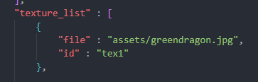

# POV_WebGL_Mix

In this activity we need to resolve several different tasks.

We had to fix the component Blazor.Expansions.Canvas, which was done following the given tutorial.

We also had to add the results of the previous activities, which included the movement of the pawn through the W and S keys, and adding shadows to the different objects of the scene.

Notice there is an added functionality, which will be explained later.

The shadows were done following pretty much the same principle that we had in the previous activity. A shader fragment was created and compiles into a program done for that very purpose. What differentiates this activity from the other one is that in this one we use a task called shadowOperations, which is called on the Draw task. Its functionality is pretty similar to the one actorDependentOperations offers, which is already defined in the project.

We also define the location attribute for the shadow, which is then applied with a task.

To apply textures to the different elements of th edemo (ship, floor, and objects), we just had to modify the level.json actor list. Notice that for this to work, we simply had to modify the "texture" field.

To make the texture repeat, we made it so that it can be tileable on any cube - which includes the floor. This was done modifying the prepareBuffers task within Game.razor.cs.

To create a firing system for the ship, we first created the logic for the keystroke. We set the key of the firing to the key F, since I did not find any keycode which would translate to the spacebar. For this, we created two boolean variables which would allow us to know when the key has been pressed, and to evade a situation in which the player can shoot infinitely by holding the pressed key.

Two new actors were defined in the level.json actor list. These actors are the bullets, and are rendered as cubes. 

When the key is pressed, a bullet is enabled and placed on the nose of the ship. To keep the bullet from spawning inside of the ship's geometry, we normalized the last known direction of the ship. As such, within the Math library a new method was created.

Once the bullet has been fired, it is pushed by a specified speed to the initial orientation of the ship. The bullet is disabled when it reaches a certain distance. The distance function was also implemented in the Math library.

Notice how in the previous image, a reference to uiInteraction.BulletMaxDistance is used. This value is a float which is set using formulary inputs within the game. These inputs manage respectively the speed of the bullet and the maximum travel distance a bullet can reach before it is disabled.

To detect collision, we use the same logical thinking that was used for the pawn in the tutorial.

We made exceptions for a collision between the pawn and a bullet, and between two bullets.

